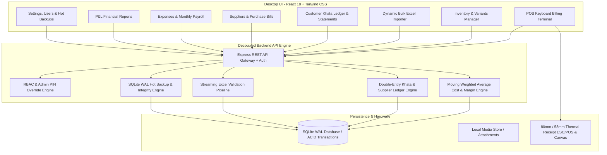

# Brand 4 Less — Enterprise Retail Management, POS & Khata Suite

A production-ready, offline-first Desktop Retail Management, Inventory, POS, Customer Khata, Supplier, Expense, and Financial Reporting System built for **Brand 4 Less** (Clothing & Accessories Retailer).

---

## 🏛️ System Architecture Overview



---

## 📦 What Was Built & Implemented

### 1. Database Schema & Persistence Layer (16 Tables)
- **Engine**: SQLite in **WAL (Write-Ahead Logging)** mode with strict foreign key constraints, 64MB cache, and immediate transaction locks (`better-sqlite3`).
- **Tables**:
  - `users` (Admin, Manager, Staff roles with bcrypt passwords & 4-digit quick POS PINs)
  - `categories` (Specific icon types: shirts, pants, watches, wallets, perfumes, shoes, caps, belts + attribute flags)
  - `products` (Master catalog with brand, local/imported origin, description, category link)
  - `product_variants` (SKU, barcode, color, size, cost price, selling price, stock quantity, min stock alert, QR payload)
  - `stock_movements` (Immutable audit log for every unit increment/decrement: `SALE`, `PURCHASE`, `SALE_RETURN`, `EXCHANGE_IN`, `EXCHANGE_OUT`, `MANUAL_ADJUSTMENT`, `DAMAGED_WRITE_OFF`)
  - `customers` & `customer_khata_ledger` (Double-entry debit/credit ledger, credit limits, running balances)
  - `suppliers`, `purchases`, `purchase_items`, `supplier_ledger` (Purchases with WAC cost recalculation, paper receipt photo/PDF uploads, payables)
  - `sales`, `sale_items`, `sale_payments` (Invoices, line-item historical cost snapshots, cash/card/bank/khata split payments)
  - `returns`, `return_items`, `exchanges` (Linked returns, stock restoration, refund method selection, exchange difference calculation)
  - `expense_categories`, `expenses` (Daily operational vouchers)
  - `staff_employees`, `salary_disbursements` (Employee directory, monthly payroll generation, approval workflow auto-posting to expenses)
  - `app_settings` & `audit_logs` (System configuration, immutable sensitive mutation logs)

---

### 2. Centralized Calculation & Costing Engine (`CalculationEngine`)
- **Moving Weighted Average Cost (WAC)**:
  $$\text{New Cost} = \frac{(\text{Existing Stock} \times \text{Existing Cost}) + (\text{Incoming Qty} \times \text{Purchase Cost})}{\text{Existing Stock} + \text{Incoming Qty}}$$
- **Historical Profit Snapshotting**: Unit cost is permanently captured in `sale_items` at transaction time so future product cost changes never distort historical profit reports.
- **Net Business Profit**:
  $$\text{Net Operating Profit} = \text{Gross Trading Profit} - \text{Returns Loss} - \text{Operating Expenses} - \text{Staff Salaries}$$

---

### 3. POS Billing Terminal (Keyboard-First)
- **Keyboard Shortcuts**:
  - `F1`: Focus search bar (Barcode, QR code, SKU, or Name search)
  - `F2`: Select or register customer profile
  - `F4`: Open Payment Modal (Checkout)
  - `F8`: Hold active cart (supports multiple simultaneous held carts)
  - `Esc`: Clear or close modals
- **Payment Methods**:
  - **Cash**: Instant change calculator with quick PKR banknote buttons (`500`, `1000`, `5000`, `Exact`).
  - **Card / Bank IBFT**: Reference note capture.
  - **Khata (Credit)**: Live customer outstanding balance validation against credit limits.
  - **Split Payment**: Split invoice across multiple methods (e.g. PKR 2,000 Cash + PKR 3,000 Card + PKR 1,000 Khata).
- **Thermal Receipt System**:
  - Standard **80mm** & **58mm** printable receipt with store header, cashier name, customer info, line items, breakdown, Khata summary, high-density digital QR code, and return policy footer.

---

### 4. Dynamic Bulk Excel / CSV Ingestion Pipeline
- **Smart Column Detection**: Automatically analyzes headers and suggests field mappings (`Product Name`, `Category`, `Color`, `Size`, `Cost Price`, `Selling Price`, `Quantity`, `Brand`, `Origin`, `SKU`, `Barcode`).
- **Interactive Mapping UI**: Allows admin to review and override mappings.
- **Real-Time Data Validation**: Validates prices, quantities, required fields, and duplicate SKUs.
- **Excel Error Report Generation**: Downloads an annotated `.xlsx` workbook highlighting exact invalid rows and error reasons.
- **Transactional Batch Ingestion**: Ingests thousands of items in < 1 second.

---

### 5. Customer Khata & Double-Entry Ledger
- **Debit / Credit Architecture**: Every credit sale writes a `SALE_CREDIT` debit entry, every payment writes a `PAYMENT_RECEIVED` credit entry.
- **Export Options**:
  - 1-Click Multi-column **Excel Spreadsheet Export** (`.xlsx`).
  - 1-Click Formatted **PDF Statement Export** (`.pdf`).

---

### 6. Suppliers, Purchases & Paper Receipts
- **Paper Receipt Attachments**: Allows cashiers/admins to attach photos or PDFs of physical supplier receipts directly to purchase bills.
- **Automatic WAC Recalculation**: Every purchase bill recalculates unit cost for all included variants and increments inventory stock.
- **Supplier Ledger**: Tracks purchase bills and payment vouchers.

---

### 7. Operating Expenses & Staff Payroll Workflow
- **Daily Expense Logging**: Shop rent, electricity, transport, maintenance, refreshments, inventory shrinkage.
- **Staff Payroll Workflow**: Generate monthly payroll $\rightarrow$ Admin reviews bonuses & deductions $\rightarrow$ Clicks "Approve & Disburse" $\rightarrow$ Automatically posts expense to "Staff Salaries" category.

---

### 8. Analytics & Financial Reports
- **Executive Dashboard**: Today's sales, Month's sales, Gross profit, Net operating profit, Low-stock alerts, Receivables, Payables, Top-selling items.
- **Profit & Loss Statement (P&L)**: Revenue, COGS, Gross Margin %, Operating Expenses breakdown, Net Margin %.
- **Stock Movement Audit Trail**: Full traceable history of every unit change.
- **Inventory Asset Valuation**: Total valuation at Cost vs Retail.
- **1-Click Excel Export**: Downloadable Excel workbooks for all reports.

---

### 9. Database Backup & Restore Center
- **Hot SQLite Backup (`VACUUM INTO`)**: Creates 100% transactional, consistent snapshots without downtime.
- **Integrity Validation**: Executes `PRAGMA integrity_check` before packaging and after restoring.
- **One-Click Restore**: Automatic safety backup before restoring any selected snapshot.

---

## 🧪 Automated Test Verification

All automated unit and integration test suites passed with **100% success rate (22/22 tests passing)**:

```bash
npm test
```

### Verified Test Cases:
1. `Moving Weighted Average Cost (WAC)` multi-batch purchase calculations.
2. `Item Metrics & Margin` formula accuracy on discounted sales.
3. `Complete Sale Totals` with overall discounts and tax rates.
4. `Period Net Operating Profit` accounting for expenses and salaries.
5. `Exchange Price Difference` calculation (customer payable vs store refund).
6. `Khata Running Balance` debit/credit consistency.
7. `RBAC Security Matrix`: Full Admin capabilities vs blocked sensitive endpoints for Staff cashiers.
8. `Product & Variant Creation` with automatic internal SKU generation and opening stock movements.
9. `Damaged Stock Adjustment` with automatic expense attribution.
10. `Customer Profile Creation` with credit limit enforcement.
11. `Atomic POS Checkout` with split payments, inventory deduction, and Khata ledger entries.
12. `Customer Payment Recording` with running balance reduction.
13. `Linked Return Processing` with inventory stock restoration and Khata credit refund.
14. `Supplier Purchase Creation` with inventory stock increments and WAC cost recalculation.
15. `Staff Payroll Generation & Approval Workflow` with auto-posting to expenses.
16. `Reporting Engine` verifying Dashboard KPIs, P&L calculations, and Inventory Valuation.

---

## 🚀 How to Run the Application

### 1. Run in Development Mode (API Server + React UI)
```bash
npm run dev
```
- **React Frontend**: http://localhost:5173
- **REST API Backend**: http://localhost:4000
- **Health Check**: http://localhost:4000/api/health

### 2. Run with Electron Desktop Shell (development)
```bash
npm run electron:dev
```

### 3. Run Automated Test Suite
```bash
npm test
```

### 4. Build & Run in Production
```bash
npm run build          # builds the React UI (dist/) and compiles the API server (dist-server/)
npm run electron:start  # launches Electron; it boots the API in-process and serves the UI on 127.0.0.1
```
In production the compiled API server (`dist-server/server.js`) also serves the built
UI, so the whole app runs from a single loopback origin. The Electron main process
starts and supervises that server automatically — there is no separate step.

> Full installer packaging (electron-builder / code signing / auto-update) is not
> yet configured and is tracked as follow-up work.

---

## 🔒 Security Notes (read before deploying)

- **Change the default passwords and PINs immediately.** The seeded `admin` / `manager` / `cashier`
  accounts exist only for first login.
- The API binds to **`127.0.0.1` only** by default. Do not change `HOST` to `0.0.0.0`
  unless you intend to expose the POS API to the local network.
- Set a strong **`JWT_SECRET`** in the environment for any real deployment. If unset,
  the server generates and persists one at `data/.jwt-secret` (fine for a single
  machine, not for a shared/redeployable setup).
- POS PINs and passwords are stored as bcrypt hashes. Login and PIN endpoints are
  rate-limited / lockout-protected against brute force.
- `data/` (the SQLite database, uploads, backups, and the JWT secret) is git-ignored
  and must never be committed — it contains customer PII and financial records.

### Environment variables
| Var | Default | Purpose |
|---|---|---|
| `PORT` | `4000` | API + UI port |
| `HOST` | `127.0.0.1` | API bind address |
| `JWT_SECRET` | auto-generated | token signing secret |
| `DATA_DIR` | `./data` | database / uploads / backups location |
| `CORS_ORIGIN` | — | extra comma-separated allowed origins (dev only) |

---

## 🔑 Default Demo Accounts

> ⚠️ These are **first-login credentials only**. Change every password and PIN before real use.

| Account Role | Username | Password | Quick POS PIN | Permissions |
|---|---|---|:---:|---|
| **System Administrator** | `admin` | `admin123` | `1234` | Full access to all modules, P&L reports, user management, backups, and salary approvals |
| **Store Manager** | `manager` | `admin123` | `5678` | POS, Products, Inventory, Customers, Khata, Suppliers, Expenses, Financial Reports |
| **Front Desk Cashier** | `cashier` | `staff123` | `0000` | POS Billing Terminal, Product Search, Customer Lookup, Khata Payment Recording |
